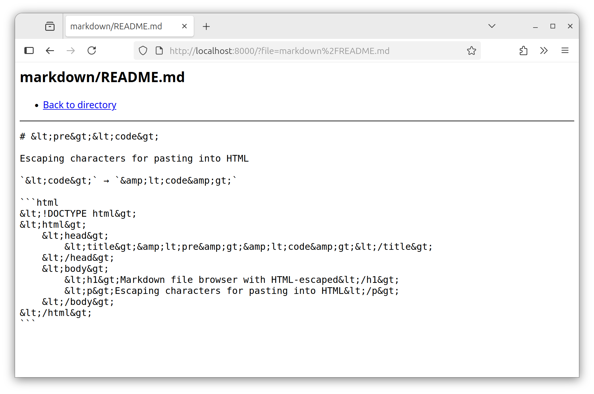

# &lt;pre&gt;&lt;code&gt;

Markdown file browser with HTML-escaped

## Features

Escaping characters for pasting into HTML

- Browse directories and Markdown files
- Handle only HTML escaping in Markdown files

## Run

Start with current directory as root:

```bash
npm start
```

Or specify a custom root directory:

```bash
npm start /path/to/directory
npm start ./markdown
```

Then open `http://localhost:8000` in your browser.


